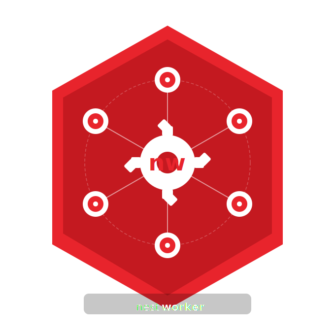

<p style="text-align: center">
  
</p>

# nestworker

Enterprise-grade worker thread module for NestJS. Offload CPU-bound work to a managed pool of Node.js worker threads without blocking the event loop — with decorator-driven auto-discovery, priority queuing, and transparent NestJS dependency injection inside workers.

---

## Features

- **Worker pool** — pre-spawned threads with backpressure queue; no jobs are ever dropped
- **Priority queue** — `HIGH / NORMAL / LOW`, binary-search sorted
- **Decorator discovery** — `@WorkerClass` + `@WorkerTask` replace all manual registration
- **DI in workers** — declared deps are snapshotted and reconstructed in each thread
- **Dynamic imports** — use `await import('node:os')` inside task methods
- **Per-task timeout** — configurable via decorator or overridden per call
- **Safe shutdown** — drains queue, terminates workers with a 2-second deadline

---

## Requirements

| Package | Version |
|---|---|
| Node.js | ≥ 16 (worker_threads) |
| `@nestjs/common` | `^10` or `^11` |
| `@nestjs/core` | `^10` or `^11` |
| `reflect-metadata` | `^0.1` or `^0.2` |
| TypeScript `target` | `ES2022` or higher |

`tsconfig.json` must have:

```json
{
  "compilerOptions": {
    "target": "ES2022",
    "experimentalDecorators": true,
    "emitDecoratorMetadata": true
  }
}
```

---

## Installation

```bash
npm install nestworker
```
---

## Quick Start

### 1. Import `WorkerModule` in your root module

```ts
// app.module.ts
import { Module } from '@nestjs/common';
import { WorkerModule } from 'nestworker';
import { ConfigService } from './config.service';
import { ImageService } from './image.service';

@Module({
  imports: [WorkerModule.forRoot()],
  providers: [ConfigService, ImageService],  // register your @WorkerClass providers here
})
export class AppModule {}
```

### 2. Decorate your service

```ts
// image.service.ts
import { Injectable } from '@nestjs/common';
import { WorkerClass, WorkerTask } from 'nestworker';
import { ConfigService } from './config.service';

@Injectable()
@WorkerClass({ deps: [ConfigService] })   // deps are injected into the worker
export class ImageService {
  constructor(private readonly configService: ConfigService) {}

  @WorkerTask({ priority: 'HIGH' })
  resizeImage(value: number): number {
    // runs in a worker thread — configService works normally here
    const multiplier = this.configService.getNumber('MULTIPLIER');
    let total = 0;
    for (let i = 0; i < 10_000_000; i++) total += i * value * multiplier;
    return total;
  }

  @WorkerTask({ priority: 'NORMAL', timeout: 5000 })
  generateThumbnail(width: number, height: number): string {
    let hash = 0;
    for (let i = 0; i < 5_000_000; i++) hash ^= (i * width * height) | 0;
    return `thumb_${hash.toString(16)}_${width}x${height}.webp`;
  }
}
```

### 3. Inject `WorkerService` and call `run()`

```ts
// image.controller.ts
import { Controller, Get } from '@nestjs/common';
import { WorkerService } from 'nestworker';

@Controller('images')
export class ImageController {
  constructor(private readonly workerService: WorkerService) {}

  @Get('resize')
  async resize() {
    return this.workerService.run<number>('ImageService', 'resizeImage', [5]);
  }

  @Get('thumbnail')
  async thumbnail() {
    return this.workerService.run<string>(
      'ImageService', 'generateThumbnail', [1920, 1080]
    );
  }
}
```
---

## Using Modules Inside Task Methods

Worker tasks are reconstructed from class source via `eval()`. Top-level `import` statements from your file are **not available** inside the worker. Use one of these two patterns instead.

### Dynamic import — preferred

`import()` is a language keyword, not a variable. It works natively inside `eval()`'d code with no setup, and is compatible with both ESM and CommonJS projects.

```ts
@WorkerTask()
async moduleImport(): Promise<string> {
  const os = await import('node:os');
  return `Import os size ${os.cpus().length}`
}
```

### Inline `require()` — CJS projects only

`require` is injected into the eval scope by `WorkerContainer`, so it works in CommonJS projects.

```ts
@WorkerTask()
async moduleRequire(): Promise<string> {
  const os = require('node:os');
  return `Require os size ${os.cpus().length}`
}
```

### What is safe to import inside a worker

| ✅ Safe | ❌ Not safe |
|---|---|
| Node built-ins: `os`, `path`, `crypto`, `zlib`, `fs` | HTTP clients (`axios`, `fetch`) |
| Pure computation libraries | Database drivers |
| `Buffer`, `Math`, `Date` | `Socket`, `Stream` |

---

## API

### `WorkerModule.forRoot(options?)`

Registers the module globally. Call once at the application root.

```ts
WorkerModule.forRoot({
  poolSize: 4,  // default: os.cpus().length
})
```

| Option | Type | Default | Description |
|---|---|---|---|
| `poolSize` | `number` | `os.cpus().length` | Number of worker threads to spawn |

---

### `@WorkerClass(options?)`

Class decorator. Marks a NestJS provider as a container of worker tasks.

```ts
@WorkerClass({ deps: [ConfigService, LoggerService] })
export class MyService { ... }
```

| Option | Type | Description |
|---|---|---|
| `deps` | `Type[]` | Injectable dependencies to reconstruct inside workers |

---

### `@WorkerTask(options?)`

Method decorator. Marks a method to be offloaded to a worker thread.

```ts
@WorkerTask({ priority: 'HIGH', timeout: 3000 })
heavyComputation(input: number): number { ... }
```

| Option | Type | Default | Description |
|---|---|---|---|
| `priority` | `'HIGH' \| 'NORMAL' \| 'LOW'` | `'NORMAL'` | Queue priority — `HIGH` jobs run first |
| `timeout` | `number` | `undefined` | Reject the job after this many ms |

---

### `WorkerService.run<T>(serviceName, methodName, args, overrides?)`

Executes a `@WorkerTask` method in a worker thread.

```ts
// Uses priority/timeout from the @WorkerTask decorator
const result = await workerService.run<number>('ImageService', 'resizeImage', [5]);

// Override priority or timeout for a specific call
const result = await workerService.run<number>(
  'ImageService', 'resizeImage', [5],
  { priority: 'LOW', timeout: 10_000 }
);
```

| Parameter | Type | Description |
|---|---|---|
| `serviceName` | `string` | Class name of the `@WorkerClass` provider |
| `methodName` | `string` | Method name decorated with `@WorkerTask` |
| `args` | `unknown[]` | Arguments to pass — must be structuredClone-compatible |
| `overrides` | `object` | Optional `priority` / `timeout` override for this call |

Returns a `Promise<T>` that resolves with the method's return value.

---

## How DI in Workers Works

Worker threads run in an isolated V8 context — they share no heap with the main thread. Passing live NestJS services across the boundary is impossible.

This module solves it in three steps:

**1. Main thread — `serializeForWorker()`**

`Class.toString()` extracts each class as a plain JS source string (no imports, no decorators). Each dep's data properties are snapshotted via `structuredClone`. Both are sent to workers via `workerData`.

**2. Worker thread — `WorkerContainer`**

The class source strings are `eval()`'d back into constructors. Each dep is reconstructed as `Object.create(DepClass.prototype) + Object.assign(snapshot)` — restoring prototype methods AND runtime state. The service class is then `new ServiceClass(...depInstances)`.

**3. Result**

`this.configService.get('KEY')` inside a worker task works exactly as on the main thread — as long as the dep reads from plain data (no DB connections, no HTTP clients).

```
MAIN THREAD                         WORKER THREAD
────────────────────────────────    ────────────────────────────────────
WorkerService.run()
  → discovery.scan()                
  → ConfigService live instance     
  → snapshot: { config: {...} }  →  Object.create(ConfigService.prototype)
  → classSource: "class Cfg..."  →  eval("class ConfigService { get()... }")
                                    Object.assign(inst, snapshot)
  → ImageService classSource     →  eval("class ImageService {...}")
                                    new ImageService(configInst)
                                    this.configService.get() ✓
```

### What deps can be passed to workers

✅ Services holding plain config data (`Record`, `Map`, arrays, primitives)  
✅ Services whose methods only read from their own properties  
❌ Services that hold DB connections, HTTP clients, or open streams  
❌ Services with `Socket`, `Stream`, or non-cloneable properties

---

## Priority Queue

Jobs queue when all threads are busy. The queue is sorted by priority — `HIGH` always runs before `NORMAL` which runs before `LOW`. Within the same priority, jobs are FIFO.

```ts
// These four tasks are dispatched to the pool concurrently.
// HIGH tasks run first regardless of arrival order.
await Promise.all([
  workerService.run('Svc', 'lowPriorityTask',    [], { priority: 'LOW'    }),
  workerService.run('Svc', 'highPriorityTask',   [], { priority: 'HIGH'   }),
  workerService.run('Svc', 'normalPriorityTask', [], { priority: 'NORMAL' }),
  workerService.run('Svc', 'highPriorityTask2',  [], { priority: 'HIGH'   }),
]);
```
---

## Constraints

### Arguments and Return Values

Task arguments and return values cross a thread boundary via `postMessage()` and must be [structuredClone](https://developer.mozilla.org/en-US/docs/Web/API/Web_Workers_API/Structured_clone_algorithm) compatible.

| ✅ Supported | ❌ Not supported |
|---|---|
| Primitives, plain objects, arrays | Class instances |
| `Map`, `Set`, `ArrayBuffer` | Functions |
| `TypedArray`, `DataView` | `Promise`, `WeakMap` |

### Circular deps

Circular dependencies between `@WorkerClass({ deps })` entries are not supported.

---

## Contributing

See the [contributing guide](https://github.com/VaheHak/nestworker/blob/master/CONTRIBUTING.md) for detailed instructions on how to get started with our project.

## License

Licensed under [MIT](https://github.com/VaheHak/nestworker/blob/master/LICENSE).
